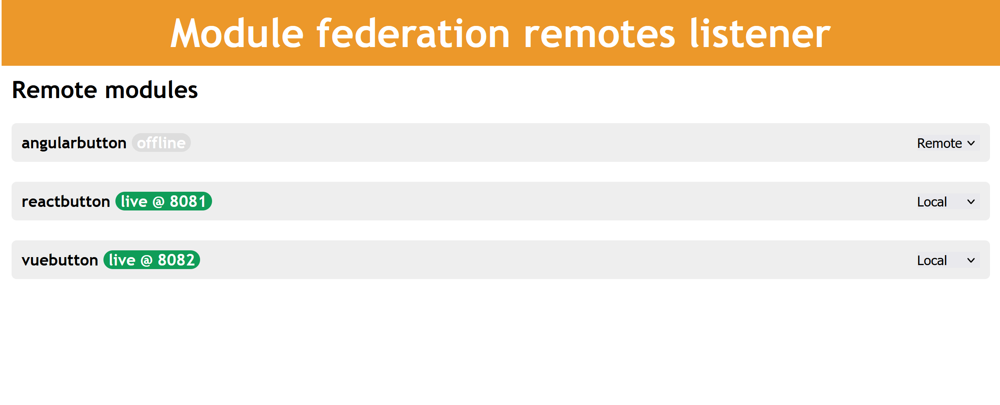

<div align="center">
  <a href="https://github.com/webpack/webpack">
    
  </a>
  <h1>Webpack micro front end proxy server</h1>
  <p>Proxy server to local or remote modules</p>
</div>

<h2 align="center">Install</h2>

```bash
  npm i --save-dev @chang-ch/mfe-proxy
```

This is a proxy server that listens to `webpack` dev servers published with `bonjour` and proxies requests to the local/remote servers.

<h2 align="center">Usage</h2>

The server will proxy requests from `/{module name}/...` to either the local source or the remote source specified.

1. Create a config file

   ```yaml
   remotes:
     component1:
       remoteUrl: remote.com # remote URL to get module from
       moduleName: component1 # name of remote module
       bonjourName: webpack-component1 # name of bonjour server
   ```

2. start `mfe-proxy`:

   ```s
   > npx @chang-ch/mfe-proxy
   ```

   A config panel will be available on the root url of the port (e.g. `localhost:8080`)

3. Change module sources as desired in the config panel

   <div align="center">
   
   </div>

   - `local` will try to proxy requests from `/{module name}/...` to `localhost:port/...` of the local dev server if available. If local dev server is unavailable requests are proxied to the remote url in the config
   - `remote` will proxy requests from `/{module name}/...` to `{remoteUrl}/...`.
